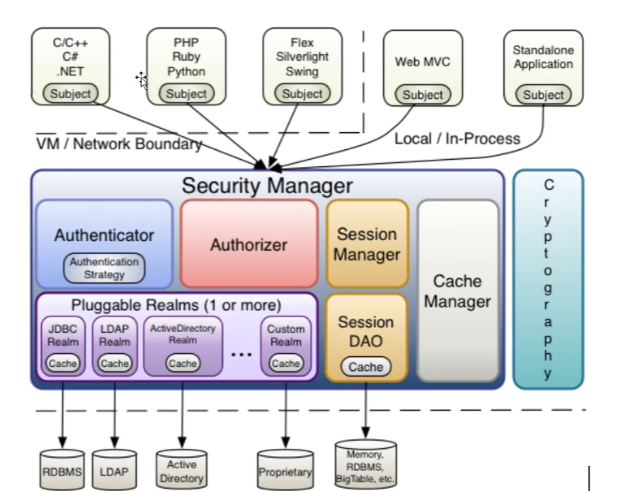
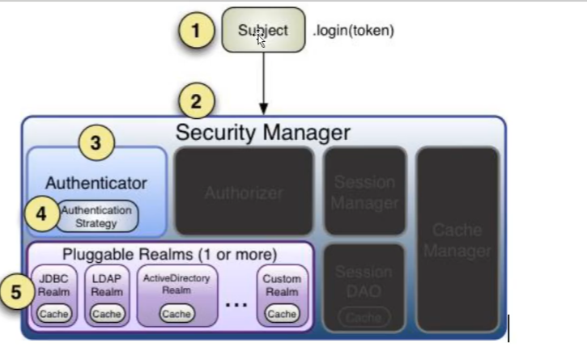

# 使用maven关于springboot2整合各种框架

## 整合SSM(mvc)

springBoot可以直接识别的目录存放
- resource
  - public   公共资源 ，所有共享的内容，对外公开的内容
  - static   静态资源 图片 js css 不会被服务器解析
    - js
  - templates   thymeleaf页面所在目录
- 整合MyBatis
- druid 可视化页面地址  druid/index.html
- 整合logback 配置文件
- 整合JSP
- 整合Thymeleaf
- 整合PageHelper 分页查询
- jar
- war 去掉内置tomcat
- 错误页面
- 单元测试 

## Scheduled 定时任务   
  - Scheduled Spring3 后内置的定时任务器
  - 存在spring-context-support.jar中
  - cron表达式 6/7个值  
    - Seconds min hour day month week year
    - Seconds min hour day month week
      -  ' *  ' 每XXX
      - ?  占位符 无意义
      - 减号如 10-12 表达一个范围  10 11 12
      - 不加任何只有数字 表示每个XXX的第 数字执行一次如2 每分钟的第二秒执行一次
      - ,表示一个列表之 如 MON,WED,FRI表示 星期一 三 五
      - / 如 x/y 表示 x为起始值，y为增量步长值 如x = 0 , y = 2 表示执行为每分钟的第0 2 4 ..秒执行
      - L 只在日期 星期字段  表示Last的意思 ， L出现在星期字段表示星期六，因为星期日是第一天
      - W 只出现日期字段距离该月最近的工作日，如15W，如果15号是星期六那么匹配14号
      - LW 当月最后一个工作日
      - 井号# 如 6#3 表示当月第三个星期五(6表示星期五 ，3表示第几个)
      - C 计划所关联的日期

  | 位置 | 时间单位 |     允许值     |     允许的特殊字符      |
  |:--:|:----:|:-----------:|:----------------:|
  | 1  |   Seconds   |   [0,59]    |     , - * /      |
  | 2  |   min   |   [0,59]    |     , - * /      |
  | 3  |   hour   |   [0,23]    |     , - * /      |
  | 4  |   day   |   [0,31]    |  , - * / L W C   |
  | 5  |   month   |   [0,23]    |     , - * /      |
  | 6  |   week   |    [0,7]    | , - * /  ? L C # |
  | 7  |   year   | [1970,2099] |     , - * /      |
- quartz定时任务  
  - 基础概念
    - job 表示一个工作，要执行的具体内容
    - JobDetail 表示一个具体的可执行的调度任务。JobDetail除了包含Job还包含了任务调度和策略
    - Trigger  触发器，配置调度参数,定义什么时候去调用
    - Scheduler 表示调度容器,Scheduler可以包含多个JobDetail和Trigger
  - 会操作数据库
    - https://www.quartz-scheduler.org/downloads/
  - [自定义定时任务类代码](Quartz%2Fsrc%2Fmain%2Fjava%2Fcom%2Fxiaoli%2Fquartz%2FMyJob.java)
  - [quartz定时任务 增删改查 恢复 暂定测试程序](Quartz%2Fsrc%2Ftest%2Fjava%2FTestQZ.java)

## Bean管理

[存放代码的位置](Bean)

[测试代码.java](Bean%2Fsrc%2Ftest%2Fjava%2FTestMyBean.java)

## [拦截器](Interceptor)

## [Shiro](Shiro) 
- 主要是做一下几点
  - 认证  用户的登录
  - 授权  用户是否有权限访问指定的URL
  - 加密  密码学对密码加密
  - Session管理
  - web集成  Shiro不依赖于容器

### Shiro的架构原理

1. Security Manager 
2. Authenticator ： 认证
3. Authorizer ： 授权
4. SessionManager ： session管理
5. Session DAO ： session的数据持久化到数据库中
6. Cache Manager  : 做缓存管理的
7. Pluggable Realms ： 
8. Realms
9. Subject

### INI文件介绍

1. main主体部分  
- 分配类对象或设置属性等操作
- 内置了根对象和: securityManager

2. users
- 定义用户,密码及用户可以具有的角色
3. roles
- 定于角色具有的权限
4. urls

- ini文件介绍

- 名词解释
  - Principal身份，用户名 邮箱，手机等能够唯一确认身份的信息
  - Credential 凭证，代表密码等
  - AuthenticationInfo:认证时存储认证信息

### 测试代码案例
[认证代码.java](Shiro%2Fsrc%2Fmain%2Fjava%2Fcom%2Fxiaoli%2FShiroRunAuthenticator.java)

[授权代码.java](Shiro%2Fsrc%2Fmain%2Fjava%2Fcom%2Fxiaoli%2FShiroRunAuthorizer.java)
 
[使用SimpleHash加密.java](Shiro%2Fsrc%2Fmain%2Fjava%2Fcom%2Fxiaoli%2FShiroRunMD5.java)

[自定义Realm.java](Shiro%2Fsrc%2Fmain%2Fjava%2Fcom%2Fxiaoli%2FShiroRunRealm.java)

### SpringBoot整合

### remember me的实现

配置文件
- shiro
  - loginUrl:/login  没有访问这个地址

### thymeleaf整合shiro

- 元素指令 
- 注解

### EHCache

- 解决每次都查数据的问题，使用缓存来加速
- 支持内存和磁盘缓存 默认存储在内存中

## Swagger2

- 地址 ： http://localhost:8080/swagger-ui/index.html

