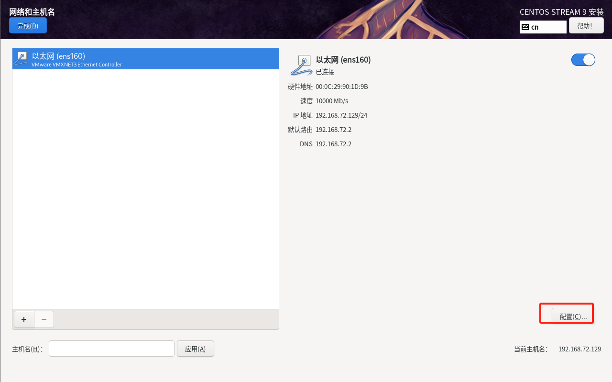

# 关于Linux系统相关的使用记录


## Linux系统的安装记录


### CentOS9安装

第一步，打开安装好的vmware软件进入页面时候按下ctrl + N 之和点击下图的下一步

第二部分：新建一个虚拟机


第三部分：配置vmware


第四部分：配置CentOS系统化配置





## 环境安装

### 安装Java环境JDK

- 第一步，把下载好的JDK上传文件到/usr/local/tmp
- 第二步，解压文件  tar zxf 上传文件的名称.tar.gz
- 第三步，解压出来的文件复制到 /usr/local中 命名javaX(JDK的版本比如:8)

- 第四步，配置环境变量


- 第五步，检验是否配置成功


### 配置Tomcat

- 第一步，把下载好的Tomcat上传文件到/usr/local/tmp
- 第二步，解压文件  tar zxf 上传文件的名称.tar.gz
- 第三步，解压出来的文件复制到 /usr/local中 命名tomcatX(JDK的版本比如:8)
- 第四步，进入tomcatX的bin文件夹，进行启动  
- 第五步，关闭防火墙
  - systemctl stop firewalld
  - systemctl disable firewalld
- 第六步，在本机浏览器输入http://192.168.72.129:8080/  


### 安装MySQL

#### 卸载mariadb
如果Linux中安装了mariadb数据库，先卸载掉，因为CentOS 9 内部集成了mariadb，mariadb数据库是mysql的分支，
而安装mysql的话会和mariadb的文件冲突，所以需要先卸载掉mariadb
- 第一步，检查是否安装mariadb数据库：yum list installed | grep mariadb

- 第二步，如果没有结果，下面直接跳过，如果有则全部卸载：yum -y remove mariadb*
- 第三步，检查mariadb是否全部卸载：yum list installed | grep mariadb


#### 安装并配置MySQL 方法1
- 第一步，cd /usr/local/tmp
- 第二步，mkdir /usr/local/mysql
- 第三步，wget https://downloads.mysql.com/archives/get/p/23/file/mysql-8.4.4-1.el9.x86_64.rpm-bundle.tar
- 第四步，mkdir mysql
- 第五步，mv mysql-8.0.30-linux-glibc2.12-x86_64.tar.xz mysql/
- 第六步，tar xf /mysql/mysql-8.0.30-linux-glibc2.12-x86_64.tar.xz mysql
- 第七步，rpm -ivh mysql-community-* --force --nodeps （# 不检查依赖并强制安装所有mysql-community-开头的rpm文件）
- 第八步，cd mysql 
```shell
# ↓创建mysql数据存放目录，存放位置可自行选择
mkdir -p /var/lib/mysql/data
mkdir -p /var/lib/mysql/run
mkdir -p /var/lib/mysql/tmp

chown -R  mysql:mysql /var/lib/mysql	# 将mysql目录的所有者给mysql用户和用户组
chown mysql:mysql /var/log/mysqld.log	# 将mysqld.log文件的所有者给mysql用户和用户组

```
- 第九步，配置MySQL : vim /etc/my.cnf
```text
  [mysqld]
  datadir=/var/lib/mysql/data
  socket=/var/lib/mysql/run/mysqld.sock
  pid-file=/var/lib/mysql/run/mysqld.pid
  tmpdir=/var/lib/mysql/tmp
  log-error=/var/log/mysqld.log
  
  character-set-server=utf8mb4
  collation-server=utf8mb4_unicode_ci
  init_connect='SET NAMES utf8mb4'
  skip-character-set-client-handshake=true
  skip-name-resolve
  
  user=mysql
  port=3306
  
  [mysql]
  port=3306
  default-character-set=utf8mb4
  
  [client]
  default-character-set=utf8mb4
  socket=/var/lib/mysql/run/mysqld.sock
  
  [mysqldump]
  quick
  max_allowed_packet=1024M
  default-character-set=utf8mb4
```
- 第十步，启动MySQL 
  - systemctl start mysql.service  
  - systemctl enable --now mysqld.service	# 开机自启并立即启动mysql
#### 安装并配置MySQL 方法2
- 第一步，cd /usr/local/tmp
- 第二步，mkdir /usr/local/mysql
- 第三步，wget https://downloads.mysql.com/archives/get/p/23/file/mysql-8.4.4-1.el9.x86_64.rpm-bundle.tar
- 第四步，tar xzf mysql-8.0.30-linux-glibc2.12-x86_64.tar.xz
- 第五步，mv mysql-8.0.30-linux-glibc2.12-x86_64 mysql8
- 第六步，
- 第七步，
- 第八步，
- 第九步，
- 第十步，

**[问题] :** Linux中安装好MySQL5.7安装完成后返现无论是建表还是新增数据等操作时，操作会成功,但是会出现错误

**解决方案 :** MySQL5.7解压版默认是不会生成配置文件的。需要自己建立

在linux中执行如下
- 配置好之和，创建用户 groupadd mysql
- 创建用户 useradd -f -g mysql mysql
- 授权    
  - cd /usr/local/mysql
  - chgrp -R mysql
  - 

#### 忘记密码
- vim /etc/my.cnf文件，在[mysqld]下添加   skip-grant-tables
- 重启MySQL服务  systemctl restart mysqld.service
- 访问MySQL  mysql -u root -p，不输入密码，直接回车键即可访问
```mysql
  use mysql;			# 使用mysql库
  update user set authentication_string="新密码" where user="root";	# 将密码置位空
  flush privileges;	# 刷新权限

```

## Shell命令


## Shell脚本


