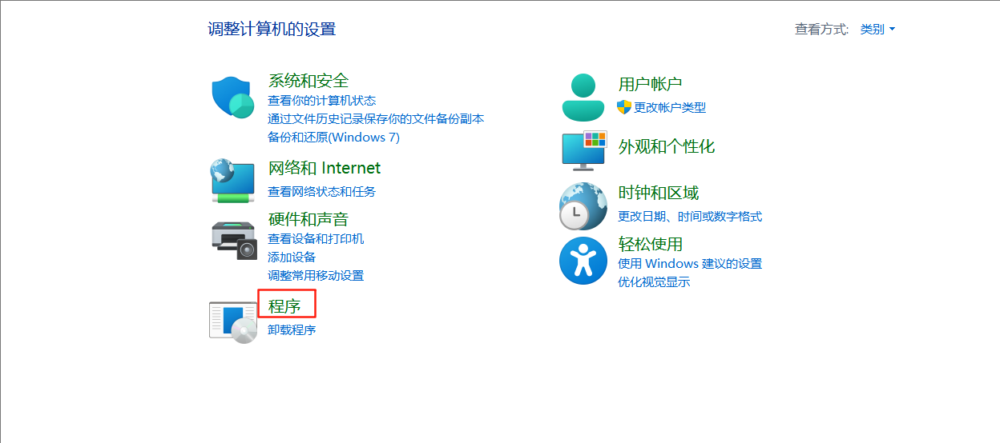
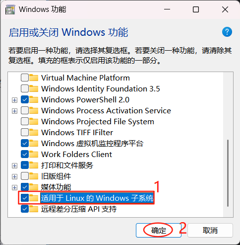
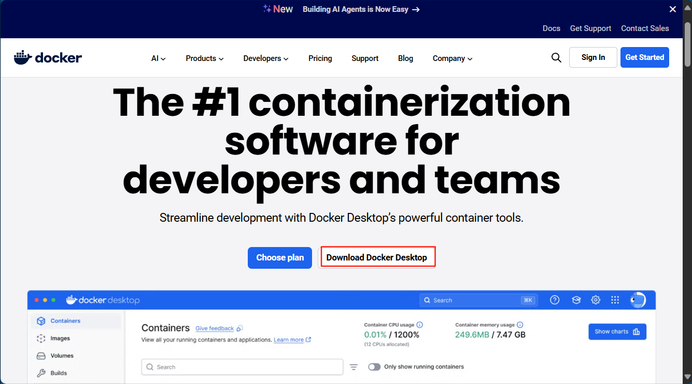
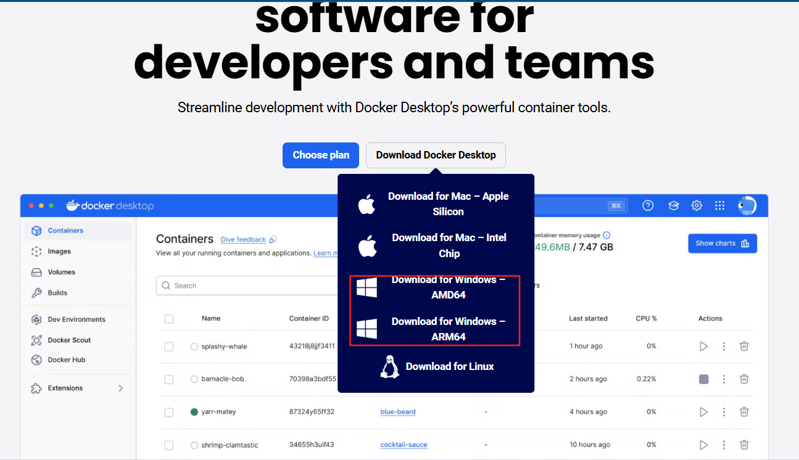
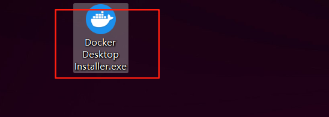
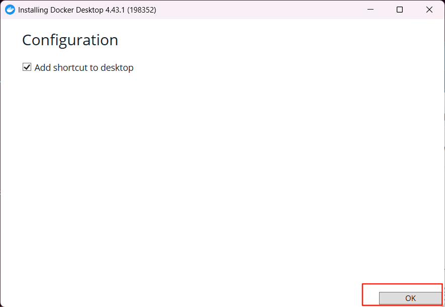
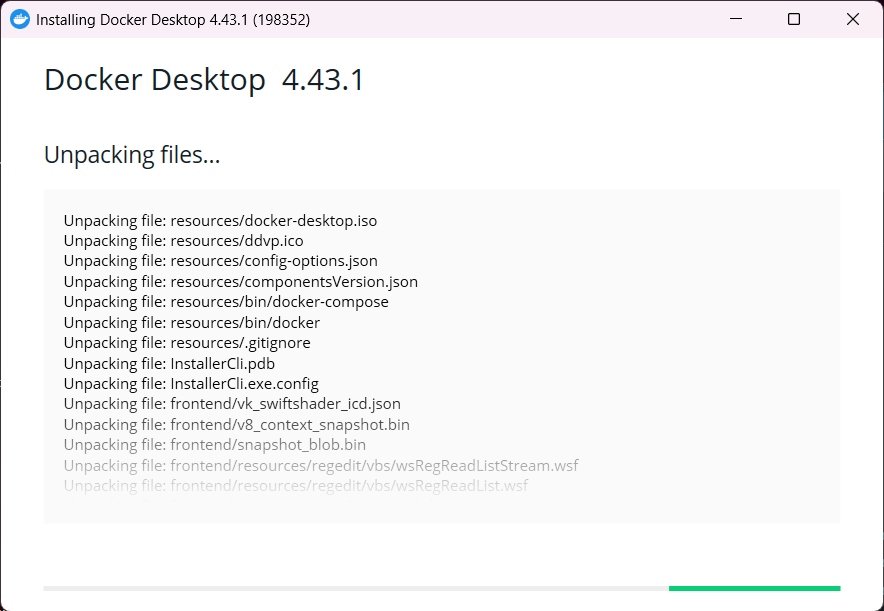
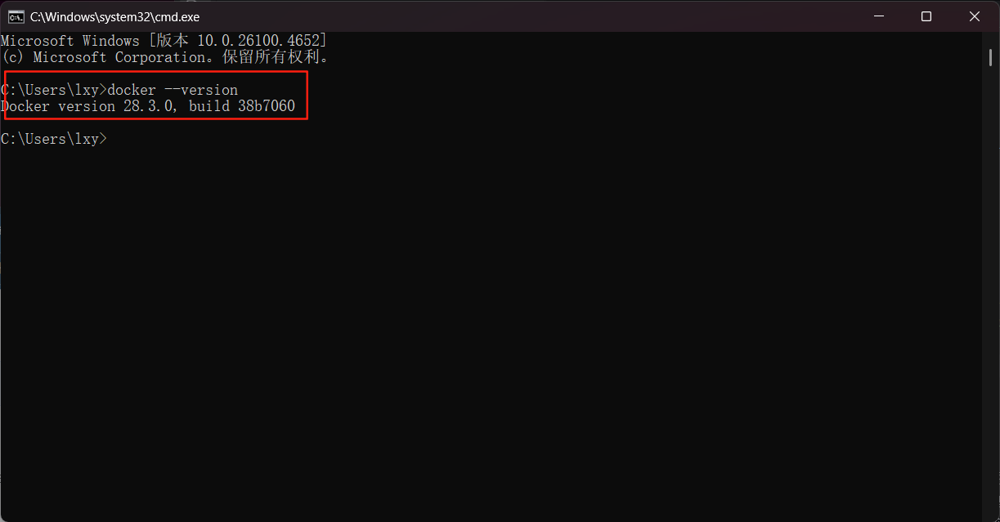
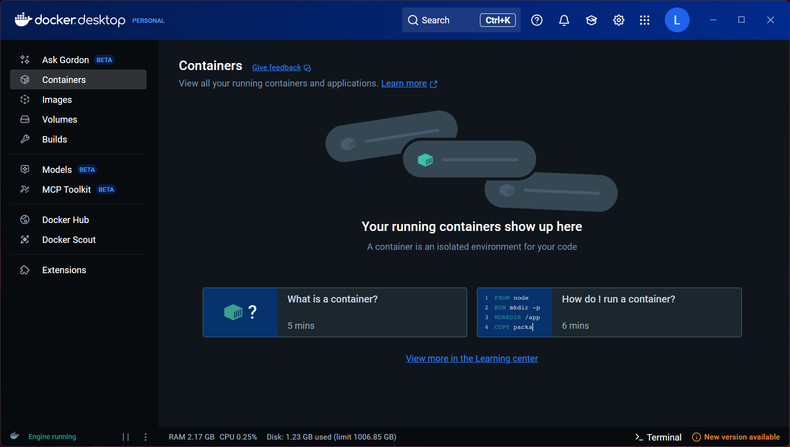

# docker的使用


## 安装

### window 安装

#### 安装准备

打开控制面板




#### 下载安装

下载连接：https://www.docker.com/products/docker-desktop/

docker_install_window_downloadInstallA001








## 架构名称
- Docker daemon (Docker 守护进程) ： 是一个运行在宿主机的后台进程，我们可以通过Docker客户端与之通信
- Client(Docker客户端)：客户端界面，可以接受用户命令和配置标识，并与Docker daemon通信，
- Images(Docker镜像)：一个只读模板，它包含创建Docker容器的说明，它和系统安装g
- Container(容器) 可运行的实力，
- Registry仓库 
- 


## 命令

### 基础命令
1. 查看镜像信息  docker images / docker image ls
2. 搜索镜像信息  docker search mysql
3. 下载镜像     docker pull mysql
4. 删除镜像     docker rmi ID / docker rmi 名称:TAG
5. 创建容器     docker create  镜像名字或者ID
比如：
```shell
docker create -p 3306:3306  --name mysql -e MYSQL_ROOT_PASSWORD=root 
\ -v /usr/local/docker/mysql/conf:/etc/mysql \
  -v /usr/local/docker/mysql/logs:/var/log/mysql \
  -v /usr/local/docker/mysql/data:/var/lib/mysql \
mysql
```
- 常见参数说明
  - --name :给容器起一个新的名字
  - -t 为容器重新分配一个伪终端
  - -i 交互模式运行容器，通常与-t 连用
  - -P 随机端口映射
  - -p 指定端口映射 hostPost:containerPort
  - -e 配置信息
  - -d 后台执行
  - -v 主机和容器目录的映射关系 :前面为主机目录，之后为容器目录
6. docker run 启动
```shell
docker run -p 3306:3306 --name mysql -e MYSQL_ROOT_PASSWORD=root -d mysql
```
7. 列出正在运行的容器 docker container ls
8. 查看容器进程信息   docker ps  -a（包含未启动的） 
- -l  显示最近创建的容器
- -n 数字  显示最近n个创建的容器
- -a 列出所有的运行过的容器
- -q 列出所有容器的id

9. 和容器做交互 docker exec -it 容器名称 bash
10. 停止容器  docker stop 容器名称/ID
11. 启动容器 docker start 容器名称/ID
12. 强制停止容器 docker kill 容器名称/ID
13. 删除容器  docker rm 容器名称/ID
14. 查看容器的日志 docker log -f -t --tail 行数 容器名称/ID

- -f 占用一个终端
- -t 加一个时间戳

15. 查看容器中运行的进程  docker top 容器名称/ID
16. 查看容器内部详情  docker inspect 容器名称/ID
17. 复制容器数据到主机  docker cp 容器名称/ID :/etc/mysql  ~/temp/mysql


### 本地构建镜像

#### 方法一
1. docker pull openjdk
2. 构建文件
```text
From openjdk:latest
VOLUME /var/mydatas（数据目录，创建的目录）
ADD xxxxx.jar app.jar (重命名为app,.jar)
ENTRYPOINT["java","-jar","/app.jar"] (运行命令)
EXPORT 8761  (对外开放的服务端口)
```
3. 构建镜像 docker build -f 构建文件  -t 镜像名称:TAG  相对目录

docker build -f buildFile -t 名称:1.0 .

5. 启动  docker run --name 服务名称 -p OSPort:8761 -d 镜像名称:TAG

#### 方法二  使用IDEA

1. 

## 第三方镜像仓库

### 阿里云的镜像仓库


### 腾讯云的镜像仓库


### 搭建本地仓库

1. docker pull registry
2. vi /usr/lib/systemd/system/docker.service


## docker 的生命周期

五种状态


## docker的数据管理


### 多容器数据共享


### 数据备份


### 数据恢复

通过容器还原备份数据
docker run --rm -itd --volumes-from 数据要恢复到的容器 -v 备份数据的目录:容器备份目录 镜像名称 家业命令

docker run --rm -itd --volumes-from 数据要恢复到的容器名称 -v /xxx/:/xxx/ 名称:id tar -xf /xxx/xxx.tar.gz -C /

还原结果？： docker exec -it my_datas bash


