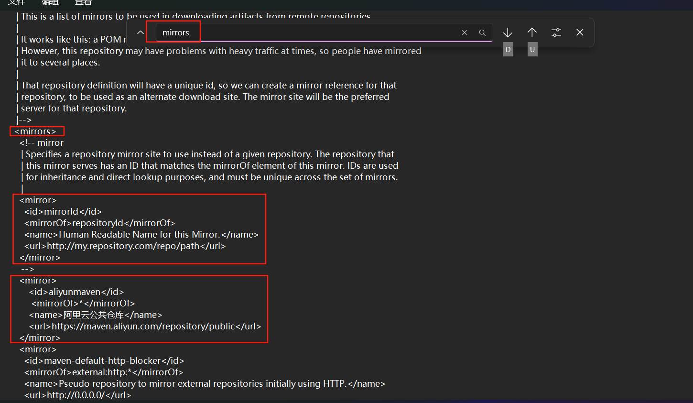
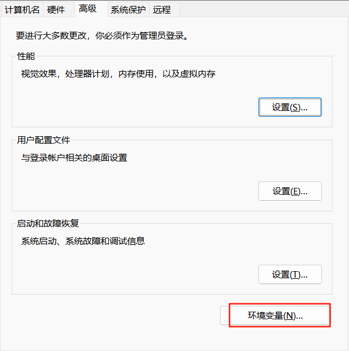
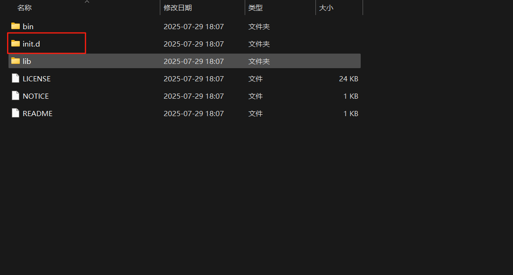

# 项目资源管理工具

## Maven
只做资源的管理，不做项目的运行

### 安装配置

#### Window11

第一步 ： 浏览器输入连接 https://maven.apache.org/download.cgi

第二步 ： 对下载的文件进行解压

解压的目录如下：

第三步 ： 配置Maven的本地仓库 和 配置镜像源

使用记事本打开setting.xml文件

第四步 ： 配置Maven的环境变量

### 基础使用与概念

- 热部署
- 打包

[基础使用.xml](ProjectMaven%2Fpom.xml)

- Maven项目之间的关系
  - 依赖关系
  - 继承关系
  - 聚合关系

## Gradle

### 安装配置

下载链接 ： https://gradle.org/releases/

#### window环境的配置

### gradle 配置

#### 仓库配置
在环境变量中配置默认的仓库地址 GRADLE_USER_HOME

#### 镜像配置

